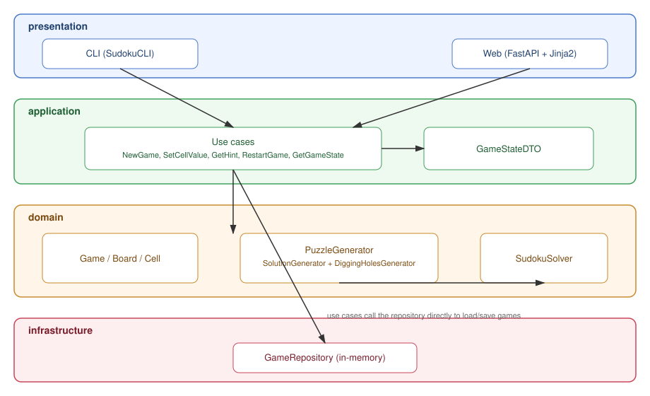
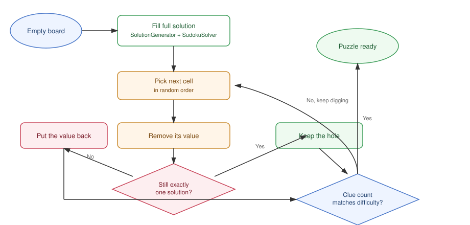

# TheSudoku

1

Before you read further, look at the picture above. It shows the main Sudoku
terms that we use in this project:

- **Row** — a horizontal line of 9 cells.
- **Column** — a vertical line of 9 cells.
- **Square** — one of the 9 blocks of 3×3 cells (also called a "box" in some
  other places, but in this project we always say **square**).
- **Cell** — a single small box that holds one digit from 1 to 9.

A Sudoku puzzle is solved when every row, every column, and every square
contains each digit from 1 to 9 exactly once.

It uses etalon **DDD (Domain-Driven Design)** and **Clean Architecture**. The game builds valid puzzles with a
"digging holes" algorithm, checks that every puzzle has only one solution, and
offers two ways to play: a console app (CLI) and a web app built with
**FastAPI** and simple HTML pages (Jinja2)

## Table of contents

- [Architecture](#architecture)
- [How puzzle generation works](#how-puzzle-generation-works)
- [Game flow](#game-flow)
- [Install and run](#install-and-run)
- [CLI commands](#cli-commands)
- [Tests and linter](#tests-and-linter)

## Architecture

The project is split into layers, following Clean Architecture rules:
dependencies always point inward, toward the domain. The domain layer does
not know anything about the application, infrastructure, or UI layers.

```
app/
├── domain/            # core: entities, value objects, domain services
│   ├── entities/       Cell, Board, Game — game entities
│   ├── value_objects/  CellValue, CellPosition, GameDifficulty, GameStatus
│   └── services/       SudokuSolver, SolutionGenerator, DiggingHolesGenerator,
│                        PuzzleGenerator — the puzzle algorithms
├── application/        # use cases + DTOs
│   ├── use_cases/       NewGame, SetCellValue, GetHint, RestartGame, GetGameState
│   ├── dto/             GameStateDTO — a snapshot of the game for the UI
│   │                    (it never includes the solution!)
│   └── exceptions.py    application-level errors
├── domain/repositories/ # BaseRepository — the port (abstract interface)
├── infrastructure/    # port implementations
│   └── repositories/    GameRepository — stores games in process memory
│                        (no database needed)
├── presentation/      # user-facing interfaces
│   ├── cli/             SudokuCLI, BoardRenderer — the text interface
│   └── web/             FastAPI app + Jinja2 templates — the web interface
├── dependencies.py    # composition root shared by CLI and web (wires use cases)
└── main.py            # entry point for the CLI
```

The diagram below shows how a request flows through the layers. Arrows point
in the direction one layer depends on another — notice how `domain` never
points outward:



## How puzzle generation works

`PuzzleGenerator` runs the whole process by combining `SolutionGenerator` and
`DiggingHolesGenerator`.

1. **Build a full solution.** `SolutionGenerator` uses `SudokuSolver` with
   random backtracking (plus the MRV heuristic — minimum remaining values) to
   fill an empty board with one valid 9×9 solution.
2. **Dig holes.** `DiggingHolesGenerator.dig(solution, difficulty)` visits the
   cells of a copy of the solution in random order and tries to remove the
   value from each cell.
3. **Check that the solution stays unique.** After a cell is cleared, the
   solver (`count_solutions`) searches for solutions again, but stops as soon
   as it finds 2. If the puzzle still has exactly one solution, the hole
   stays. Otherwise, the value is put back.
4. The process stops once the number of remaining clues matches the chosen
   difficulty (see `app/domain/constants.py`): EASY = 40, MEDIUM = 32,
   HARD = 17.

To stop the uniqueness check from exploding combinatorially on very sparse
boards, `count_solutions` uses an attempts budget (`attempts_budget`). If the
budget runs out, the hole is not dug — a safe choice that keeps the puzzle a
little easier, but always correct and fast to generate.



## Game flow

- `Game` is the aggregate root: it stores the player's current board and the
  solution separately, checks for a win after every move, and does not allow
  changes to the original "fixed" clues.
- `SetCellValueUseCase` sets or clears a cell's value, following Sudoku rules.
- `GetHintUseCase` reveals the correct value for an empty, non-fixed cell.
- `RestartGameUseCase` clears the player's moves, keeping the original
  puzzle.
- No database is used: active games are stored in process memory through
  `GameRepository` (the implementation of the `BaseRepository` port). Both
  interfaces (CLI and web) use the same set of use cases — all game logic
  lives only in `domain/` and `application/`. `presentation/cli` and
  `presentation/web` are just two different "faces" on top of it.

## Install and run

The project uses [`uv`](https://docs.astral.sh/uv/) to manage dependencies
(Python 3.14+).

```bash
uv sync
```

### Option 1: console game (CLI)

```bash
uv run python main.py
```

### Option 2: web interface (FastAPI + HTML)

```bash
uv run uvicorn app.presentation.web.app:app --reload
```

Then open **http://127.0.0.1:8000/** in your browser. There you can choose a
difficulty, start a game, type digits directly into the board cells and save
your move with a button, ask for a hint, and reset your progress. Templates
live in `app/presentation/web/templates/` (Jinja2) — no database and no
frontend build step are required.

## CLI commands

```
new <easy|medium|hard>   start a new game with the chosen difficulty
set <row> <col> <value>  place a digit (1-9) in a cell (row/column 1-9)
clear <row> <col>        clear a cell you filled in earlier
hint <row> <col>         reveal the correct value of a cell
restart                  reset your moves, keeping the original puzzle
show                     show the board again
help                     show the list of commands
quit                     exit the game
```

Example session:

```
> new easy
> set 1 3 5
> hint 2 2
> restart
> quit
```
